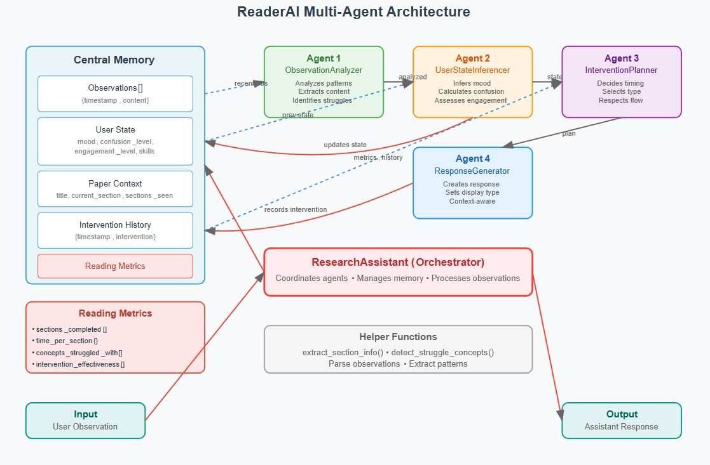
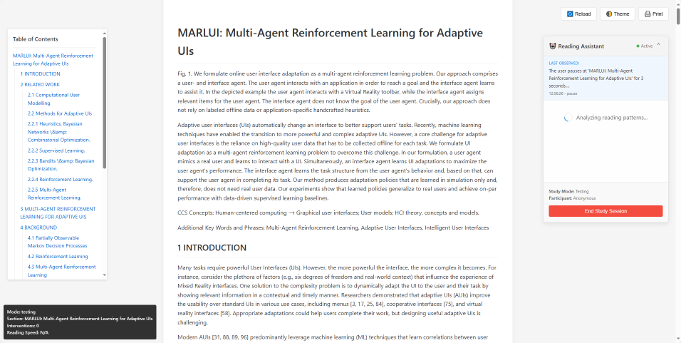
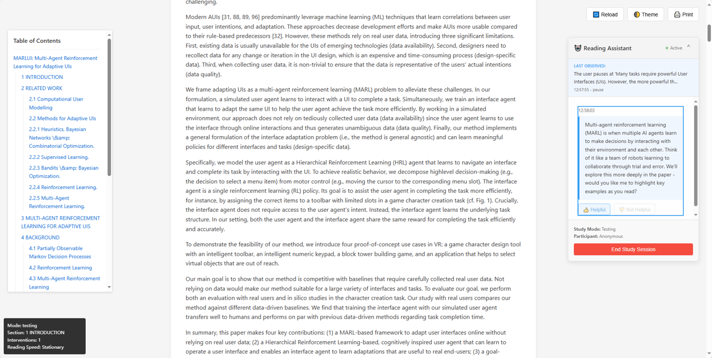
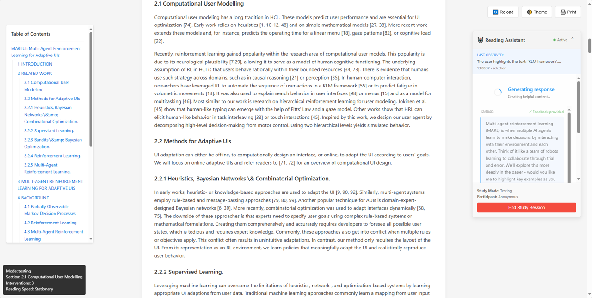
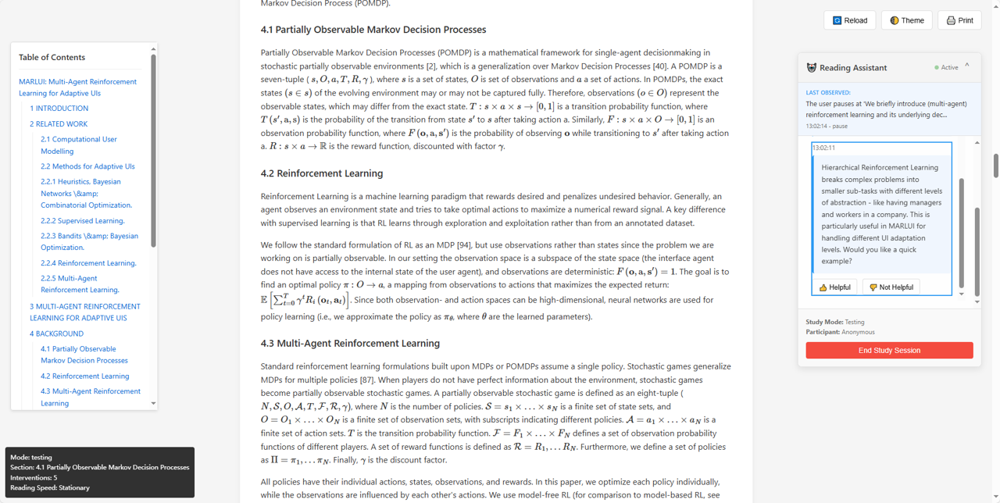
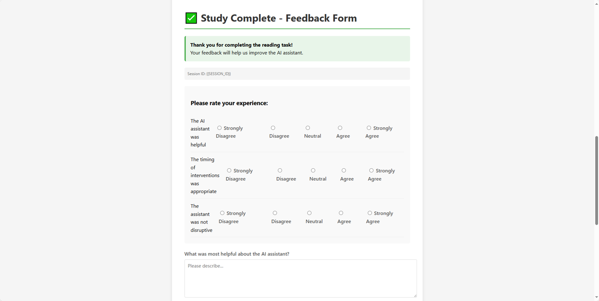

# Multi-Agent LLM-Powered Research Paper Reading Assistant

A sophisticated reading assistant that uses multiple AI agents to help researchers and students understand scientific papers more effectively. The system observes reading behavior in real-time and provides contextual assistance when needed, reducing reading comprehension time by an average of 30%.

## Overview

This project implements an intelligent reading assistant that monitors user behavior while reading research papers and provides timely, context-aware interventions. Using a multi-agent architecture powered by Large Language Models, the system can detect confusion, identify struggling concepts, and offer help without being intrusive.

## Key Features

### Behavioral Tracking
- **Scroll Pattern Analysis**: Detects reading speed (fast skimming vs. careful reading)
- **Pause Detection**: Identifies when users pause on difficult content (>3 seconds)
- **Re-reading Recognition**: Tracks when users scroll back to previous sections
- **Text Selection Monitoring**: Captures highlighted text indicating interest or confusion
- **Hover Tracking**: Detects when users hover over technical terms or equations
- **Focus Management**: Knows when users leave/return to the document
- **Section Progress**: Tracks time spent on each section and completion status

### Multi-Agent Intelligence
- **Observation Analyzer**: Consolidates recent behaviors into structured insights
- **User State Inferencer**: Maintains cognitive load, confusion level, and emotional state
- **Intervention Planner**: Decides timing and type of assistance based on urgency
- **Response Generator**: Creates contextual, encouraging, and helpful messages

### Smart Intervention System
- **Natural Break Points**: Prefers to intervene at section transitions
- **Intervention Types**:
  - Concept explanations for detected confusion
  - Section summaries at transitions
  - Encouragement during frustration
  - Break suggestions for cognitive overload
  - Related resources for deeper understanding
- **Timing Control**: Enforces minimum 30-second gaps between interventions
- **Queue Management**: Intelligently filters observations when AI is busy

### Study Infrastructure
- **Session Management**: Unique IDs for participants and sessions
- **Comprehensive Metrics**: Reading time, intervention effectiveness, concept struggles
- **Feedback Collection**: Real-time user feedback on intervention helpfulness
- **Data Export**: JSON format for analysis, automated report generation

## System Architecture



The system consists of four key components:

1. **Frontend Tracking** (`study_plugin.js`): Captures user reading behavior
2. **Multi-Agent Backend** (`ReaderAI.py`): Processes observations through specialized agents
3. **Browser Infrastructure** (`MarkdownBrowser.py`): Provides the reading environment
4. **Study Framework** (`empirical_study.py`): Manages research sessions and data collection

### AI Agent Pipeline

1. **Observation Analyzer**: Extracts patterns from user behavior
2. **User State Inferencer**: Determines cognitive load and emotional state
3. **Intervention Planner**: Decides whether and how to intervene
4. **Response Generator**: Creates helpful, contextual messages

## How It Works: Deep Dive

### 1. Observation Collection
The frontend JavaScript continuously monitors user interactions:
```javascript
// Example: Detecting pauses
if (idle > 3000) {
    sendObservation("User pauses at 'regularization' for 3 seconds", "pause");
}
```

### 2. Observation Processing
Observations are queued and filtered before sending to AI:
- Text selections get priority (explicit user interest)
- Recent observations provide context
- Duplicates are prevented
- Maximum 4 observations processed at once

### 3. Multi-Agent Analysis
Each agent uses structured prompts to process information:

**Agent 1** identifies: Current content, reading patterns, struggle indicators
**Agent 2** infers: Mood, confusion level (0-1), engagement level (0-1)
**Agent 3** decides: Should intervene?, intervention type, urgency level
**Agent 4** generates: Appropriate response, display format

### 4. Contextual Memory
The system maintains rich state across observations:
- Paper structure (title, sections)
- User progression through sections
- Concepts the user struggled with
- Previous interventions and their effectiveness
- Reading speed history

### 5. Intervention Delivery
Responses appear as:
- **Sidebar**: Gentle suggestions that don't block reading
- **Popup**: Urgent help for high confusion/frustration
- **Inline**: Contextual tooltips (for future development)

## Installation

1. Clone the repository:
```bash
git clone https://github.com/RumiaTouhou/llm-paper-reader.git
cd llm-paper-reader
```

2. Install dependencies:
```bash
pip install -r requirements.txt
```

3. Configure API credentials in `ReaderAI.py`:
```python
DEFAULT_API_URL = '<your-openai-compatible-api-url>'
DEFAULT_API_KEY = 'sk-<your-api-key>'
```

## Usage

### Testing Mode (Development)

For testing the system with debug information:
```bash
python empirical_study.py --mode testing
```

This shows:
- Real-time observation logging
- AI agent decision process
- Debug overlay with metrics
- No intro/feedback pages

### Evaluation Mode (User Study)

For conducting formal user studies:
```bash
python empirical_study.py --mode evaluation --participant-id P001
```

This includes:
- Introduction page with consent
- Clean interface (no debug info)
- Post-reading feedback form
- Session data export

### Using Custom Papers

1. Place your markdown paper in the project directory
2. Load it directly with the browser:
```bash
python MarkdownBrowser.py your-paper.md
```

Or modify `empirical_study.py` to load your custom paper:
```python
browser.load_markdown_file('your-paper.md')
```

## Advanced Customization

### Adding Custom Plugins

The browser supports a plugin system for extending functionality. Create a new plugin:

```python
from MarkdownBrowser import Plugin

# Example: Word count plugin
def create_word_count_plugin():
    return Plugin(
        name="word-count",
        html_content="""
<div class="word-count-widget">
    <h3>Reading Statistics</h3>
    <div id="word-stats">
        <p>Total words: <span id="total-words">0</span></p>
        <p>Reading time: <span id="reading-time">0</span> min</p>
    </div>
</div>
""",
        css="""
.word-count-widget {
    position: fixed;
    right: 20px;
    bottom: 20px;
    padding: 15px;
    background: white;
    border: 1px solid #ddd;
    border-radius: 5px;
}
""",
        javascript="""
document.addEventListener('DOMContentLoaded', function() {
    const content = document.querySelector('.content-wrapper').textContent;
    const wordCount = content.trim().split(/\\s+/).length;
    const readingTime = Math.ceil(wordCount / 200); // 200 words per minute
    
    document.getElementById('total-words').textContent = wordCount;
    document.getElementById('reading-time').textContent = readingTime;
});
"""
    )

# Register in your code
browser = DirectMarkdownBrowser()
browser.register_plugin(create_word_count_plugin())
```

Plugins can also include:
- **Markdown preprocessors**: Transform markdown before rendering
- **HTML postprocessors**: Modify rendered HTML
- **API endpoints**: Handle AJAX requests from JavaScript

```python
def my_api_handler(data):
    return {"result": "processed"}

my_plugin = Plugin(
    name="my-plugin",
    api_endpoints={
        'process': my_api_handler  # Available at /api/plugin/my-plugin/process
    }
)
```

### Modifying AI Behavior

#### 1. Adjust Intervention Thresholds
Edit `study_config.json`:
```json
{
  "ai_behavior": {
    "min_intervention_gap": 60,        // Increase for less frequent help
    "confidence_threshold": 0.8,        // Higher = more selective interventions
    "max_interventions_per_section": 1, // Limit help per section
    "prefer_natural_breaks": true
  }
}
```

#### 2. Customize Agent Prompts
Modify system prompts in `ReaderAI.py`:
```python
class InterventionPlanner:
    def __init__(self, client):
        self.system_prompt = """Your modified prompt here...
        
        Consider:
        - User's learning style (add to state tracking)
        - Paper difficulty level
        - Time pressure indicators
        """
```

#### 3. Add New Intervention Types
Extend the intervention types:
```python
# In InterventionPlanner prompt
Intervention types:
1. concept_explanation
2. section_summary
3. encouragement
4. break_suggestion
5. related_resources
6. section_transition
7. quiz_question      # NEW: Test understanding
8. visual_diagram     # NEW: Offer visual explanation
9. example_provision  # NEW: Provide concrete example
```

#### 4. Modify State Inference
Add new state dimensions:
```python
# In UserStateInferencer
"learning_style": "visual/textual/example-based",
"time_pressure": "low/medium/high",
"prior_knowledge": "beginner/intermediate/advanced"
```

### Creating Custom Behavioral Patterns

#### 1. Define New Observation Types
Add to `study_config.json`:
```json
{
  "observation_templates": {
    "equation_struggle": "User spends {{duration}} seconds on equation: {{equation}}",
    "definition_lookup": "User looks up definition of '{{term}}'",
    "note_taking": "User takes notes: '{{note_content}}'",
    "figure_examination": "User examines Figure {{number}} for {{duration}} seconds"
  }
}
```

#### 2. Implement Detection Logic
Add to `study_plugin.js`:
```javascript
// Detect equation struggles
function detectEquationStruggle() {
    const equations = document.querySelectorAll('.MathJax');
    equations.forEach(eq => {
        let hoverStart = null;
        
        eq.addEventListener('mouseenter', () => {
            hoverStart = Date.now();
        });
        
        eq.addEventListener('mouseleave', () => {
            if (hoverStart) {
                const duration = (Date.now() - hoverStart) / 1000;
                if (duration > 5) {  // 5 seconds threshold
                    sendObservation(
                        `User examines equation for ${duration} seconds`,
                        'equation_struggle'
                    );
                }
            }
        });
    });
}
```

#### 3. Create Behavior Profiles
Track patterns over time:
```javascript
const behaviorProfile = {
    avgReadingSpeed: [],
    struggleConcepts: new Set(),
    preferredSections: [],
    frustrationTriggers: [],
    
    updateProfile(observation) {
        // Analyze patterns
        if (observation.type === 'rapid_scroll') {
            this.frustrationTriggers.push('information_overload');
        }
    }
};
```

#### 4. Custom Metrics
Add to `ReadingMetrics` class:
```python
def track_custom_metric(self, metric_name: str, value: any):
    if metric_name not in self.custom_metrics:
        self.custom_metrics[metric_name] = []
    self.custom_metrics[metric_name].append({
        "timestamp": datetime.now().isoformat(),
        "value": value
    })

# Usage
metrics.track_custom_metric("equation_comprehension_time", 45.2)
metrics.track_custom_metric("definition_lookups", ["regularization", "gradient"])
```

## Configuration

Edit `study_config.json` to customize:

- **Tracking Parameters**: Pause duration, scroll sampling rate, hover detection
- **AI Behavior**: Intervention frequency, confidence thresholds
- **UI Settings**: Widget position, notification duration
- **Observation Templates**: Customize observation descriptions

## Study Results

In our empirical evaluation with 7 participants:
- **6 out of 7** found the assistant useful for understanding papers
- **30% average reduction** in time needed to fully comprehend papers
- Participants reported feeling more confident tackling difficult concepts

## Showcase Screenshots

Screenshots demonstrating the system in action, including the reading interface with AI assistant widget, real-time behavioral tracking, intervention responses, and study session management.







## Project Structure

```
llm-paper-reader/
├── empirical_study.py      # Main study orchestration
├── ReaderAI.py            # Multi-agent AI system
├── MarkdownBrowser.py     # Browser-based viewer
├── study_plugin.js        # Frontend behavior tracking
├── study_plugin.css       # UI styling
├── study_templates.html   # Study interface templates
├── study_config.json      # Configuration settings
├── SamplePaper.md         # Example research paper
├── requirements.txt       # Python dependencies
└── Example Usage.txt      # Demonstration scenarios
```

## API Requirements

The system requires access to an OpenAI-compatible API endpoint. The default configuration uses the DeepSeek-V3 model, but any compatible API can be used by modifying the configuration in `ReaderAI.py`.

## License

This project is licensed under the MIT License. See [LICENSE](LICENSE) file for details.

## Author

Created by [RumiaTouhou](https://github.com/RumiaTouhou)

## Acknowledgments

- Built as part of research on AI-assisted reading comprehension
- Uses MathJax for LaTeX rendering in research papers
- Powered by OpenAI-compatible language models